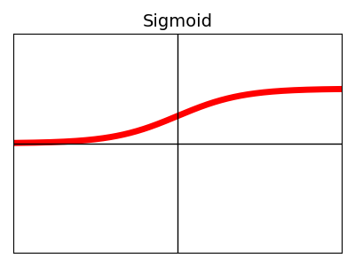
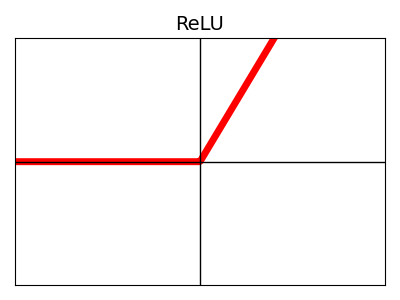
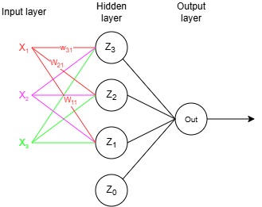

# What is a neural network?
The neural nets are invented by researcher who are trying to replicate the human brain. In 1943, warren McCulloch and Walter Pitts published a paper which describes a mathematical model of how the human brain works. It leads to the first notion of artificial neural network. The model treated neurons binary meaning it either fires or not, which is eventually seen as fundament for (deep) neural nets. In 1953 the perceptron was created, which can be seen as the first artificial neural net.  A visual representation of the perceptron can be seen below. 

 It can be seen that the net only consists of one layer of inputs and one layer of outputs.  Let’s take go through this diagram we start at the input. These inputs will be multiplied with weights and propogate as output, which results in the following equation: 
	
$z = w_1x_1 + w_2x_2 + w_3x_3 + w_4b$

However be aware that the b stands for bias and always will be added to the summations. As the name suggest is the bias used to ensure that the network can linearly shift independently of the input. To fully propgagte through the network an activation function is required, because otherwise if you have multiple layers in a row this will just be a weighted summation and the network will explode. To solve this problem activation functions are introduced. The activation function determines what the output will be of the perceptron. The difference between the peceptron and neuron is that for the perceptron has only the step-function as output, while for neurons different activation fucntions can be chosen.  The formula for one neuron or percepton is therefore defined as:

$y = \mathcal{f}( b + \sum^n_{i = 1} x_iw_i)$

In this function $\mathcal{f}$ is defined is the activation function, $b$ is the bias, $n$ is the number of nodes, $x$ is the input feature, $w$ is the weight for the corresponding input feature. 
In the case of neurons, he activation allows for non-linear function approximation. The most simple example is just a threshold (as already mentioned for the case of a perceptron), if for example the weighted sum if z is higher than a specific a number this neuron will fire true. There a lot of different activation functions, the most common one are depicted as graph below. 

| Name | Shape | Name | Shape |
|------------|-------| ---|--|
| **Sigmoid** |  | **ReLU** | |
**Tanh** |  | **Step** | |

What type of boolean operations can the perceptron mimic? Hint is a truth/false table. 

The perceptron is only limited towards linear classification. It can thus approximate an and and or function, but it can not estimate a non-linear function. The reason for this is that it only calculates a linear combination of inputs and applies a single non-linear transformation.  It means that the classification is done based upon a linear line, because the input (defined in equation) is a linear summation. Therefore, only one neuron will never be able to estimate non-linear functions. 

Multiple layers of perceptron/neurons are required to estimate a non-linear function. A schematic of this can be seen below as well, this is considered a neural net. 

In this example there is only one hidden layer, but you can expand this with as many layers as you like. The hidden layer is nothing else as another neuron.  These can be used after training to perform classification for example or regression.  Now let’s have more detailed look at this diagram. The inputs and weights of the inputs are colored to ease the reading of the diagram. Before we can propogate through this diagram it is important to know how to write things and refer to them. In other words, if we are talking for example about the weight used to map from input neuron 1 to hidden layer neuron 1 we need a common method to write this down. Starting with the inputs, they are noted as $x_j$ 
, which means input number $j$. It is important to note that $x_0$ is clamped at 1, because it is considered the bias term.  
$W_{ij}^{[l]}$, where $W$ stands for weight,  it connects neuron $j$ in layer $l-1$ to neuron $i$ in layer $l$. The weight $W_{i0}^{[l]}$
is reserved for the bias in layer $l$.  The activation layer is noted as $a^{[l]}_j$
, which is the activation function for neuron $j$ in layer $l$, $z_{i}^{[l]}$
is defined as the output of neuron $j$ in layer $l$. Here again it is important to note that $z_0$ is clamped at value 1, because of the bias, 
$y_i$ is defined as the output for neuron $i$.

Now that the notations are know we can calculate the forward propagation of this diagram. 

Let’s calculate this throughput together. Starting with neuron $Z_1$
$z_1^{[1]}=a_1^{[1]}(W^{[1]}_{11}x_1+W^{[1]}_{21}x_2+W^{[1]}_{31}x_3 + W^{[1]}_{01}x_0)$

neuron two:

$z_2^{[1]} = a_2^{[1]} (W_{11}^{[1]}x_1 +W_{21}^{[1]}x_2 + W_{31}^{[1]}x_3 )$

Neuron three  

$z_3^{[1]} = a_3^{[1]} (W^{[1]}_{11}x_1 +W^{[1]}_{21}x_2 + W^{[1]}_{31}x_3 )$

You might have noticed there is similarity between these methods of writing down. A more efficient method can be used if we start using matrices. In this way we can do a more easier form of multiplication instead of writing these equations separately.  A nice addition of this is that the computer can quickly and easily perform these matrix calculations. The matrix notation to calculated Z is defined as follows

$
\begin{aligned}
Z = \begin{bmatrix} 
W_{11} & W_{21} & W_{31} \\
W_{12} & W_{22} & W_{32} \\
W_{13} & W_{23} & W_{33}
\end{bmatrix}

 \begin{bmatrix} 
x_1 \\
x_2 \\
x_3
\end{bmatrix}
\end{aligned}

Each row in the weight matrix corresponding to set of weights for one neuron.  The advantage of writing it in this matter is that allows for faster calculations. 
After which only the activation function should be calculated for each hidden layer. This calculation will go through the output layer. How would the output layer look in terms of matrix calculation ?
  

% Now that you know what feedforward is you can have a look at the follwoing link. Her eyou can play around and estimate yourself with these neural nets. the A Neural Network Playground.  In the next section we will go more hands on and look how can implement these things ourselkvest