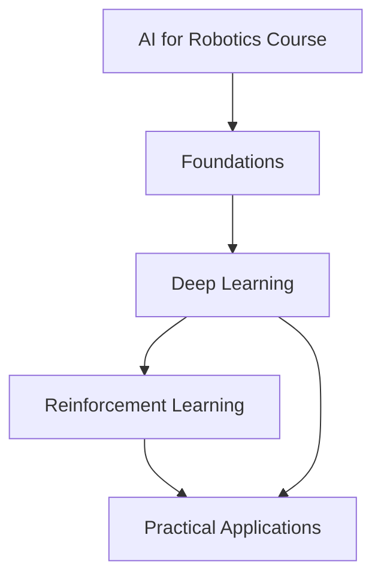

# :material-robot: AI for Robotics Course

This course covers AI concepts applied to robotics. It's organized into three modules: foundations, deep learning, and reinforcement learning.

## Course Modules

=== "Foundations"

    ### :material-book-open-variant: Foundations
    
    Covers fundamental concepts for AI in robotics.
    
    - Core robotics principles
    - Basic AI concepts for robotics
    
    [Get Started with Foundations :material-arrow-right:](foundations/index.md){ .md-button .md-button--primary }

=== "Deep Learning"

    ### :material-brain: Deep Learning
    
    Neural networks and deep learning for robotic applications.
    
    - Neural network architectures
    - Deep learning for perception and control
    - Implementation examples
    
    [Get Started with Deep Learning :material-arrow-right:](deep_learning/index.md){ .md-button .md-button--primary }

=== "Reinforcement Learning"

    ### :material-gamepad-variant: Reinforcement Learning
    
    How robots learn behaviors through environment interaction.
    
    - Markov Decision Processes (MDPs)
    - Value-based and policy-based methods
    - Q-Learning and Policy Gradients
    - Implementation examples
    
    [Get Started with Reinforcement Learning :material-arrow-right:](reinforcement_learning/index.md){ .md-button .md-button--primary }

## Course Features

Each module includes (except foundations):

| Feature | Description |
|---------|-------------|
| :material-book-education: **Theory** | Concept explanations with mathematical foundations |
| :material-notebook: **Interactive Notebooks** | Google Colab notebooks for practice |
| :material-help-circle: **Quizzes** | Multiple choice questions |
| :material-code-tags: **Code Examples** | Implementations you can run and modify |

!!! note "Setup"
    Everything runs in simulation (Google Colab). No hardware or local setup required.

## Prerequisites

Recommended background:

- :material-code-braces: **Basic programming knowledge** (conditional, loops, variables)
- :material-language-python: **Python familiarity** (all examples use Python)
- :material-calculator: **Linear algebra and calculus basics** (vectors, matrices, derivatives)

??? note "Not required"
    
    - No ROS experience needed
    - No hardware deployment experience needed
    - No special equipment needed

## Getting Started

Suggested order:

1. Foundations
2. Deep Learning
3. Reinforcement Learning
