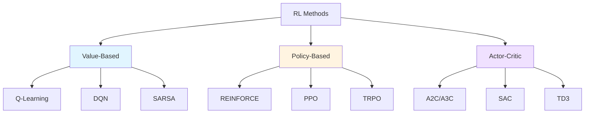

# Policy-Based vs Value-Based Methods

## Two Philosophies for Solving RL Problems

Now that we understand the MDP framework, how do we actually find the optimal policy \( \pi^* \)?

There are two fundamentally different approaches:

1. **Value-Based Methods**: Learn to estimate how good states or actions are, then derive a policy
2. **Policy-Based Methods**: Directly learn the policy that maps states to actions

Both aim to find \( \pi^* \), but they take very different paths to get there!

## Value-Based Methods: Learn the Value, Extract the Policy

### Core Idea

**"If I know how valuable each action is, I can just pick the best one!"**

Value-based methods learn a value function (typically \( Q(s, a) \)) that estimates the expected return for taking action \( a \) in state \( s \). Once we have good estimates of \( Q(s, a) \), the policy is trivial:

\[
\pi(s) = \arg\max_a Q(s, a)
\]

**Simple interpretation:** In each state, choose the action with the highest Q-value!

### The Learning Process

```mermaid
graph LR
    A[Experience<br/>s, a, r, s'] --> B[Update Q-values]
    B --> C[Q-table or<br/>Q-network]
    C --> D[Policy: π(s) = argmax Q(s,a)]
    D --> E[Take action]
    E --> A
```

### Examples of Value-Based Methods

- **Q-Learning**: Learn Q-values through Bellman updates
- **SARSA**: On-policy variant of Q-learning
- **DQN (Deep Q-Network)**: Use neural networks to approximate Q-values
- **Double DQN, Dueling DQN**: Improvements on DQN

### Advantages ✅

1. **Sample efficient**: Each experience can update many action values
2. **Off-policy learning**: Can learn from any experience (even random actions!)
3. **Deterministic optimal policy**: For many problems, the optimal policy is deterministic
4. **Easy to understand**: "Pick the action with highest value" is intuitive
5. **Stable in discrete action spaces**: Clear max operation over actions

### Disadvantages ❌

1. **Limited to discrete actions**: Computing \( \arg\max_a Q(s,a) \) is hard when actions are continuous
2. **No stochasticity**: Derived policy is deterministic (can be addressed with exploration strategies)
3. **Instability with function approximation**: Can diverge when using neural networks (though solutions exist)
4. **Maximization bias**: Taking max can overestimate values

### When to Use Value-Based Methods?

✅ **Discrete action spaces** (e.g., game controls, discrete robot commands)

✅ **Off-policy learning is valuable** (want to learn from demonstrations or replay buffers)

✅ **Deterministic policies are acceptable**

❌ **Continuous action spaces** (robotics with motor torques, joint angles)

## Policy-Based Methods: Learn the Policy Directly

### Core Idea

**"Why bother with value functions? Just learn the policy itself!"**

Policy-based methods directly parameterize the policy \( \pi_\theta(a|s) \) with parameters \( \theta \) and optimize it to maximize expected return.

**Key insight:** We optimize \( \theta \) to maximize:

\[
J(\theta) = \mathbb{E}_{\tau \sim \pi_\theta}[G(\tau)] = \mathbb{E}_{\tau \sim \pi_\theta}\left[\sum_t \gamma^t r_t\right]
\]

This is a **direct optimization** of what we care about!

### The Learning Process

```mermaid
graph LR
    A[Collect trajectories<br/>using πθ] --> B[Compute returns]
    B --> C[Compute gradients<br/>∇θ J(θ)]
    C --> D[Update policy<br/>θ ← θ + α∇θJ(θ)]
    D --> A
```

### Examples of Policy-Based Methods

- **REINFORCE**: Basic policy gradient algorithm
- **TRPO (Trust Region Policy Optimization)**: Safe policy updates
- **PPO (Proximal Policy Optimization)**: More practical version of TRPO
- **A3C (Asynchronous Advantage Actor-Critic)**: Parallel policy learning

### Advantages ✅

1. **Natural for continuous actions**: Can directly output continuous values
2. **Can learn stochastic policies**: Sometimes optimal policy is stochastic!
3. **Better convergence properties**: Typically more stable than value-based methods
4. **Effective in high-dimensional action spaces**: No need to evaluate all actions
5. **Can learn from limited observability**: Works naturally in POMDPs

### Disadvantages ❌

1. **Sample inefficient**: Need many trajectories to estimate gradients
2. **High variance**: Gradient estimates can be noisy
3. **On-policy by default**: Must collect new data after each update (can be expensive)
4. **Can converge to local optima**: Gradient-based optimization doesn't guarantee global optimum
5. **Slower to train**: Needs more environment interactions

### When to Use Policy-Based Methods?

✅ **Continuous action spaces** (robotic control, motor commands)

✅ **High-dimensional action spaces**

✅ **Stochastic policies needed** (e.g., rock-paper-scissors, partially observable environments)

✅ **Stability is important**

❌ **Sample efficiency is critical** (real-world robot learning with limited trials)

## Side-by-Side Comparison

| Aspect | Value-Based | Policy-Based |
|--------|-------------|--------------|
| **What do we learn?** | \( Q(s, a) \) or \( V(s) \) | \( \pi_\theta(a \mid s) \) |
| **Policy extraction** | \( \pi(s) = \arg\max_a Q(s,a) \) | Policy is directly learned |
| **Action space** | Best for discrete | Best for continuous |
| **Policy type** | Deterministic (usually) | Can be stochastic |
| **Sample efficiency** | More efficient | Less efficient |
| **Convergence** | Can be unstable | More stable |
| **Off-policy learning** | Natural | Requires importance sampling |
| **Exploration** | Via ε-greedy, etc. | Via stochastic policy |
| **Examples** | Q-Learning, DQN | REINFORCE, PPO |

## Intuitive Examples

Let's understand the difference with concrete examples:

### Example 1: Grid World Navigation

**Value-Based Approach:**

```
Learn Q-values for each state-action pair:

State (2,3):
  Q(s, up)    = 5.2
  Q(s, down)  = 3.1
  Q(s, left)  = 4.8
  Q(s, right) = 7.3  ← Highest!

Policy: π(s) = right
```

The agent learns "how good is each direction?" then picks the best.

**Policy-Based Approach:**

```
Learn policy directly:

State (2,3):
  π(up | s)    = 0.10
  π(down | s)  = 0.05
  π(left | s)  = 0.15
  π(right | s) = 0.70  ← Most likely

Sample action from this distribution
```

The agent learns "which direction should I go?" directly.

### Example 2: Robot Arm Control

**Problem:** Move robot arm to target position

**Action space:** 7 joint torques (continuous, \(\mathbb{R}^7\))

**Value-Based Challenge:**
```
How do we compute argmax Q(s, a) when a ∈ ℝ⁷?
- Would need to evaluate Q for infinitely many actions!
- Or discretize actions (loses precision)
```

**Policy-Based Solution:**
```
Policy directly outputs continuous actions:
π_θ(s) → [τ₁, τ₂, τ₃, τ₄, τ₅, τ₆, τ₇]

Or outputs distribution parameters:
π_θ(s) → μ(s), σ(s)
Sample: a ~ N(μ(s), σ(s))
```

This is natural and efficient!

## The Exploration Strategy Difference

### Value-Based Exploration

Must add exploration explicitly:

**ε-greedy:**
```python
if random() < epsilon:
    action = random_action()  # Explore
else:
    action = argmax_a Q(s, a)  # Exploit
```

**Boltzmann exploration:**
```python
probabilities = softmax(Q_values / temperature)
action = sample(probabilities)
```

### Policy-Based Exploration

Exploration is **built into the policy**!

```python
# Stochastic policy (e.g., Gaussian)
mean, std = policy_network(state)
action = sample_normal(mean, std)  # Naturally explores!

# Entropy bonus encourages exploration
loss = -expected_return + entropy_coefficient * entropy(policy)
```

The randomness of the policy provides natural exploration.

## Continuous Action Spaces: Why Policy Methods Shine

### The Challenge with Value Methods

For continuous actions \( a \in \mathbb{R}^n \):

\[
\pi(s) = \arg\max_{a \in \mathbb{R}^n} Q(s, a)
\]

This is an **optimization problem at every timestep**!

**Options:**
1. **Discretize actions**: Loses precision, curse of dimensionality
2. **Use optimization**: Expensive, need many Q-function evaluations
3. **Assume Q is simple**: Rarely true (quadratic approximations, etc.)

### Policy Methods: Natural Fit

Policy network directly outputs continuous actions:

```python
# Policy network architecture
state → [Neural Network] → action_mean, action_std

# Gaussian policy
action = action_mean + action_std * random_normal()
```

**No argmax needed!** Just a forward pass through the network.

## Stochastic vs Deterministic Policies

### When is a Stochastic Policy Optimal?

**Example 1: Rock-Paper-Scissors**

Optimal policy: \( \pi(\text{rock}) = \pi(\text{paper}) = \pi(\text{scissors}) = 1/3 \)

If you're deterministic, opponent can exploit you!

**Example 2: Partially Observable Environments**

If you can't see the full state, randomizing can be beneficial.

**Example 3: Multi-Agent Settings**

Don't want to be predictable to other agents.

### Value Methods Struggle Here

Value-based methods naturally give deterministic policies:
\[
\pi(s) = \arg\max_a Q(s, a)
\]

To get stochasticity, must add it artificially (ε-greedy, Boltzmann).

Policy methods can naturally represent stochastic optimal policies!

## Actor-Critic: Best of Both Worlds?

We'll cover this in detail later, but here's a preview:

**Idea:** Combine value and policy methods!

- **Actor (policy)**: Decides which actions to take
- **Critic (value)**: Evaluates how good those actions were

```mermaid
graph LR
    A[State s] --> B[Actor:<br/>πθ(a|s)]
    A --> C[Critic:<br/>V(s) or Q(s,a)]
    B --> D[Action a]
    C --> E[TD Error]
    E --> B
    E --> C
```

**Benefits:**
- Lower variance than pure policy methods (critic helps)
- Works with continuous actions (actor handles this)
- More sample efficient than pure policy methods

**Examples:** A2C, A3C, SAC, TD3, PPO (with value baseline)

## Summary: Which Approach Should You Use?

### Use Value-Based Methods When:

✅ You have **discrete action spaces**
✅ **Sample efficiency** is critical
✅ You want **off-policy** learning
✅ Deterministic policies are fine

**Example tasks:**
- Atari games
- Grid world navigation
- Discrete robot control (waypoint selection)

### Use Policy-Based Methods When:

✅ You have **continuous action spaces**
✅ You need **stochastic policies**
✅ **Stability** is more important than sample efficiency
✅ High-dimensional action spaces

**Example tasks:**
- Robot manipulation (continuous joint torques)
- Locomotion (continuous motor commands)
- Drone control
- Autonomous driving

### Use Actor-Critic When:

✅ You want a **balance** of both approaches
✅ Continuous actions **and** sample efficiency
✅ You want stability of policy methods with lower variance

**Example tasks:**
- Most modern robotics applications!
- Continuous control with sample constraints

## The Big Picture



**Historical note:**
- **Classic RL**: Started with value-based methods (tabular Q-learning)
- **Deep RL**: DQN (2015) showed value methods could scale to complex tasks
- **Modern robotics**: Policy methods (especially PPO) dominate due to continuous control
- **State-of-the-art**: Actor-critic methods combining best of both

## Coming Up Next

Now that you understand the two main approaches, let's dive into specific algorithms:

1. **Q-Learning**: The classic value-based method
2. **REINFORCE**: The classic policy gradient method

Understanding these foundations will help you grasp modern algorithms like DQN, PPO, SAC, and more!

---

## Check your understanding
[Quiz 3](3_quiz.md){ .md-button }

[← Back to MDP](2_mdp.md){ .md-button }
[Continue to Q-Learning →](4_value_based.md){ .md-button .md-button--primary }

