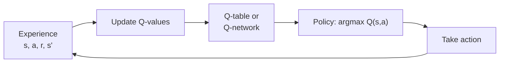
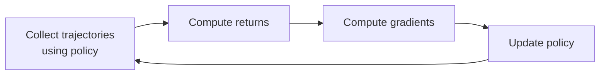
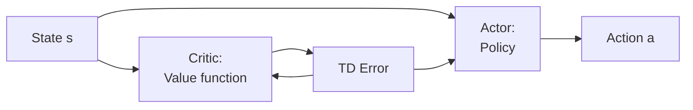
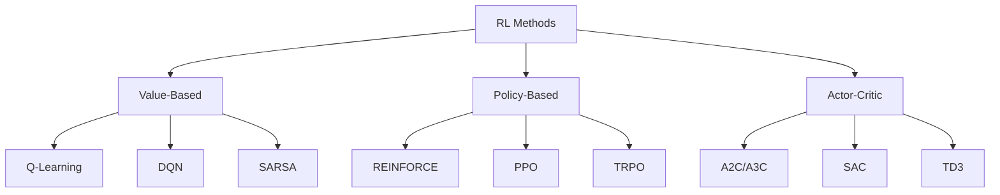

# Policy-Based vs Value-Based Methods

## Two Philosophies for Solving RL Problems

Now that we understand the MDP framework, how do we actually find the optimal policy \( \pi^* \)?

There are two fundamentally different approaches:

1. **Value-Based Methods**: Learn to estimate how good states or actions are, then derive a policy
2. **Policy-Based Methods**: Directly learn the policy that maps states to actions

Both aim to find \( \pi^* \), but they take very different paths to get there!

## Value-Based Methods: Learn the Value, Extract the Policy

### Core Idea

**"If I know how valuable each action is, I can just pick the best one!"**

Value-based methods learn a value function (typically \( Q(s, a) \)) that estimates the expected return for taking action \( a \) in state \( s \). Once we have good estimates of \( Q(s, a) \), the policy is trivial:

\[
\pi(s) = \arg\max_a Q(s, a)
\]

**Simple interpretation:** In each state, choose the action with the highest Q-value!

### The Learning Process



### Advantages

1. **Sample efficient**: Each experience can update many action values
2. **Off-policy learning**: Can learn from any experience (even random actions!)
3. **Deterministic optimal policy**: For many problems, the optimal policy is deterministic
4. **Easy to understand**: "Pick the action with highest value" is intuitive
5. **Stable in discrete action spaces**: Clear max operation over actions

### Disadvantages

1. **Limited to discrete actions**: Computing \( \arg\max_a Q(s,a) \) is hard when actions are continuous
2. **No stochasticity**: Derived policy is deterministic (can be addressed with exploration strategies)

### When to Use Value-Based Methods?

**Discrete action spaces** (e.g., game controls, discrete robot commands)

**Off-policy learning is valuable** (want to learn from demonstrations or replay buffers)

**Deterministic policies are acceptable**

**Continuous action spaces** (robotics with motor torques, joint angles)

## Policy-Based Methods: Learn the Policy Directly

### Core Idea

**"Why bother with value functions? Just learn the policy itself!"**

Policy-based methods directly parameterize the policy \( \pi_\theta(a|s) \) with parameters \( \theta \) and optimize it to maximize expected return.

**Key insight:** We optimize \( \theta \) to maximize:

\[
J(\theta) = \mathbb{E}_{\tau \sim \pi_\theta}[G(\tau)] = \mathbb{E}_{\tau \sim \pi_\theta}\left[\sum_t \gamma^t r_t\right]
\]

This is a **direct optimization** of what we care about!

### The Learning Process



### Advantages

1. **Natural for continuous actions**: Can directly output continuous values
2. **Can learn stochastic policies**: Sometimes optimal policy is stochastic!
3. **Effective in high-dimensional action spaces**: No need to evaluate all actions
4. **Can learn from limited observability**: Works naturally in POMDPs

### Disadvantages

1. **High variance**: Gradient estimates can be noisy
2. **Can converge to local optima**: Gradient-based optimization doesn't guarantee global optimum
3. **Slower to train**: Needs more environment interactions

### When to Use Policy-Based Methods?

**Continuous action spaces** (robotic control, motor commands)

**High-dimensional action spaces**

**Stochastic policies needed** (e.g., rock-paper-scissors, partially observable environments)

**Stability is important**

**Sample efficiency is critical** (real-world robot learning with limited trials)

## Side-by-Side Comparison

| Aspect | Value-Based | Policy-Based |
|--------|-------------|--------------|
| **What do we learn?** | \( Q(s, a) \) or \( V(s) \) | \( \pi_\theta(a \mid s) \) |
| **Policy extraction** | \( \pi(s) = \arg\max_a Q(s,a) \) | Policy is directly learned |
| **Action space** | Best for discrete | Best for continuous |
| **Policy type** | Deterministic (usually) | Can be stochastic |
| **Sample efficiency** | More efficient | Less efficient |
| **Convergence** | Can be unstable | More stable |
| **Off-policy learning** | Natural | Requires importance sampling |
| **Examples** | Q-Learning, DQN | REINFORCE, PPO |

## The Exploration Strategy Difference

### Value-Based Exploration

Must add exploration explicitly:

**ε-greedy:**
```python
if random() < epsilon:
    action = random_action()  # Explore
else:
    action = argmax_a Q(s, a)  # Exploit
```

### Policy-Based Exploration

Exploration is **built into the policy**!

```python
# Stochastic policy (e.g., Gaussian)
mean, std = policy_network(state)
action = sample_normal(mean, std)  # Naturally explores!

# Entropy bonus encourages exploration
loss = -expected_return + entropy_coefficient * entropy(policy)
```

The randomness of the policy provides natural exploration.

## Continuous Action Spaces: Why Policy Methods Shine

### The Challenge with Value Methods

For continuous actions \( a \in \mathbb{R}^n \):

\[
\pi(s) = \arg\max_{a \in \mathbb{R}^n} Q(s, a)
\]

This is an **optimization problem at every timestep**!

**Options:**
1. **Discretize actions**: Loses precision, curse of dimensionality
2. **Use optimization**: Expensive, need many Q-function evaluations
3. **Assume Q is simple**: Rarely true (quadratic approximations, etc.)

### Policy Methods: Natural Fit

Policy network directly outputs continuous actions:

```python
# Policy network architecture
state → [Neural Network] → action_mean, action_std

# Gaussian policy
action = action_mean + action_std * random_normal()
```

**No argmax needed!** Just a forward pass through the network.

## Actor-Critic: Best of Both Worlds?

We'll cover this in detail later, but here's a preview:

**Idea:** Combine value and policy methods!

- **Actor (policy)**: Decides which actions to take
- **Critic (value)**: Evaluates how good those actions were



**Benefits:**
- Lower variance than pure policy methods (critic helps)
- Works with continuous actions (actor handles this)
- More sample efficient than pure policy methods

## Summary: Which Approach Should You Use?

### Use Value-Based Methods When:

You have **discrete action spaces**
**Sample efficiency** is critical
You want **off-policy** learning
Deterministic policies are fine

**Example tasks:**
- Atari games
- Grid world navigation
- Discrete robot control (waypoint selection)

### Use Policy-Based Methods When:

You have **continuous action spaces**
You need **stochastic policies**
**Stability** is more important than sample efficiency
High-dimensional action spaces

**Example tasks:**
- Robot manipulation (continuous joint torques)
- Locomotion (continuous motor commands)
- Drone control
- Autonomous driving

### Use Actor-Critic When:

You want a **balance** of both approaches
Continuous actions **and** sample efficiency
You want stability of policy methods with lower variance

**Example tasks:**
- Most modern robotics applications!
- Continuous control with sample constraints

## The Big Picture



**Historical note:**

- **Classic RL**: Started with value-based methods (tabular Q-learning)
- **Deep RL**: DQN (2015) showed value methods could scale to complex tasks
- **Modern robotics**: Policy methods (especially PPO) dominate due to continuous control
- **State-of-the-art**: Actor-critic methods combining best of both

## Coming Up Next

Now that you understand the two main approaches, let's dive into two foundational algorithms that best illustrate each:

1. **Q-Learning:** This is the classic value-based method. Q-Learning is simple to implement and directly demonstrates how an agent can learn the value of actions in each state through experience.

2. **REINFORCE:** This is the foundational policy-gradient (policy-based) method. REINFORCE shows how we can directly optimize the policy itself—learning probabilities of actions—by following the gradient of expected reward.

We focus on these two because each cleanly represents the "pure" version of its approach: Q-Learning for value-based and REINFORCE for policy-based methods. Everything else is an extension of these two with bells and whistles for optimization and stability.

Understanding these foundations will help you grasp modern algorithms like DQN, PPO, SAC, and more!

---

## Check your understanding
[Quiz 3](3_quiz.md){ .md-button }

[← Back to MDP](2_mdp.md){ .md-button }
[Continue to Q-Learning →](4_value_based.md){ .md-button .md-button--primary }

