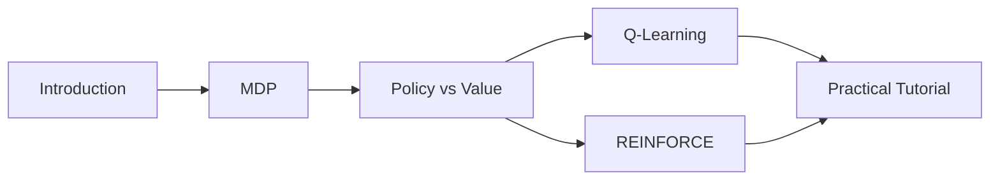

# Reinforcement Learning Module

## Overview

This module focuses on reinforcement learning techniques for robotic control, decision-making, and autonomous behavior. Learn how robots can learn from interaction with their environment.

## Topics Covered

- **Introduction to RL**: Intuitive explanation of RL concepts with real-world examples from Boston Dynamics, drone racing, and more.

- **Markov Decision Processes (MDPs)**: Mathematical framework: states, actions, rewards, transitions, and the Bellman equations.

- **Policy vs Value-Based Methods**: Understanding the fundamental difference between learning values vs learning policies directly.

- **Q-Learning**: The classic value-based algorithm with detailed implementation and convergence properties.

- **Policy Gradients**: Direct policy optimization using gradient ascent on expected returns.

- **Practical Implementation**: Build REINFORCE from scratch and compare with PPO from Stable-Baselines3.

## Learning Path

## Module Contents

- [Introduction to RL](introduction.md) - Intuitive introduction with real-world examples
- [Markov Decision Processes](mdp.md) - Mathematical framework for RL
- [Policy vs Value-Based Methods](policy_vs_value.md) - Understanding different approaches
- [Q-Learning](value_based.md) - Classic value-based algorithm
- [Policy Gradients (REINFORCE)](policy_based.md) - Direct policy optimization
- [Practical Tutorial](practical_tutorial.md) - Hands-on implementation from scratch

## Prerequisites

- Foundations module completed
- Deep Learning basics
- Probability theory

---

[Start with Introduction to RL →](introduction.md){ .md-button .md-button--primary }

