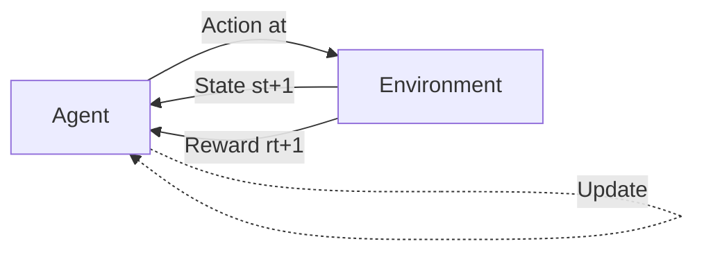

# Markov Decision Processes (MDPs)

## From Intuition to Formalism

In the introduction, we talked about agents learning through interaction with an environment. Now let's make this precise using the mathematical framework of **Markov Decision Processes (MDPs)**.

MDPs provide a formal way to model sequential decision-making problems. Don't worry—we'll build up the concepts step by step!

## The Key Components

An MDP is defined by a tuple: \( \mathcal{M} = (\mathcal{S}, \mathcal{A}, \mathcal{P}, \mathcal{R}, \gamma) \)

Let's break down each component:

### 1. State Space \( \mathcal{S} \)

**Definition:** The set of all possible states the environment can be in.

**What is a state?**
A state is a complete description of the environment at a particular time. It contains all the information needed to predict what happens next (given an action).

**Examples:**

- **Robot navigation**: Position (x, y, θ), velocity, battery level
- **Inverted pendulum**: Pole angle, angular velocity, cart position, cart velocity
- **Robotic arm**: Joint angles \([θ_1, θ_2, ..., θ_n]\) and joint velocities
- **Drone**: 3D position, orientation (roll, pitch, yaw), velocities, angular rates

**Continuous vs. Discrete:**
- **Discrete**: Finite number of states (e.g., grid world positions)
- **Continuous**: Infinite states (e.g., robot joint angles can be any real number in a range)

### 2. Action Space \( \mathcal{A} \)

**Definition:** The set of all possible actions the agent can take.

**Examples:**

- **Mobile robot**: Forward, backward, turn left, turn right (discrete)
- **Robotic arm**: Joint torques \([\tau_1, \tau_2, ..., \tau_n]\) (continuous)
- **Drone**: Throttle commands for each motor (continuous)
- **Quadruped**: Target foot positions or joint angle trajectories (continuous)

**Discrete vs. Continuous:**
- **Discrete**: Finite set of actions (e.g., {up, down, left, right})
- **Continuous**: Actions are real-valued vectors (e.g., motor torques in \(\mathbb{R}^n\))

### 3. Transition Dynamics \( \mathcal{P} \)

**Definition:** The probability of transitioning to state \( s' \) when taking action \( a \) in state \( s \).

Mathematically: \( \mathcal{P}(s' | s, a) = P(S_{t+1} = s' | S_t = s, A_t = a) \)

**What does this mean?**
The transition function describes the "physics" or "rules" of the environment. It tells us:
- If I'm in state \( s \) and take action \( a \), what state \( s' \) will I end up in?

**Important properties:**

- **Stochastic**: The next state might be random (e.g., slipping on ice, sensor noise)
- **Deterministic**: Special case where \( \mathcal{P}(s' | s, a) = 1 \) for one \( s' \) and 0 for all others
- **Markov Property**: The next state depends only on the current state and action, not on the history

The Markov property is key: \( P(S_{t+1} | S_t, A_t, S_{t-1}, A_{t-1}, ...) = P(S_{t+1} | S_t, A_t) \)

**Example - Robot on slippery floor:**
```
State: Robot at position (1, 1), action: Move Right
Possible outcomes:
  - 70% probability: Actually move right to (2, 1)
  - 20% probability: Slip and stay at (1, 1)
  - 10% probability: Slip forward to (1, 2)
```

In robotics, the transition dynamics are typically unknown (we don't have a perfect model of physics) which is why RL is valuable!

### 4. Reward Function \( \mathcal{R} \)

**Definition:** The immediate reward received after taking action \( a \) in state \( s \) and transitioning to \( s' \).

Mathematically: \( \mathcal{R}(s, a, s') \) or often simplified as \( \mathcal{R}(s, a) \) or \( \mathcal{R}(s) \)

**What is reward?**
Reward is the feedback signal that tells the agent how good its action was. It's how we communicate our objective to the agent.

**Key principle:** We don't tell the agent *how* to achieve the goal, only *what* the goal is through rewards!

**Examples:**

- **Reaching a goal**: +100 when reaching target, -1 per timestep (encourages speed)
- **Staying balanced**: +1 for every timestep upright, -100 for falling
- **Energy efficiency**: Negative reward proportional to torque magnitude
- **Smooth motion**: Penalty for large accelerations or jerky movements

**Reward Engineering is Critical:**

Good reward design:
```
✅ Reach goal: +100
✅ Each timestep alive: -1
✅ Collision: -50
Result: Fast, safe navigation
```

Poor reward design:
```
❌ Only goal reward: +100
❌ Nothing else
Result: Might take forever or behave dangerously
```

!!! warning "Reward Shaping Challenges"
    Designing rewards is one of the hardest parts of RL! You need to:
    - Specify what you want, not how to achieve it
    - Avoid unintended behaviors (reward hacking)
    - Balance multiple objectives
    - Ensure rewards are achievable through exploration

### 5. Discount Factor \( \gamma \)

**Definition:** A number between 0 and 1 that determines how much the agent values future rewards versus immediate rewards.

**Why do we need discounting?**

1. **Mathematical convenience**: Ensures infinite sums converge
2. **Preference for earlier rewards**: Captures that immediate rewards are often more certain
3. **Finite horizon approximation**: Effectively limits the planning horizon

**Interpretation:**

- \( \gamma = 0 \): Only care about immediate reward (myopic)
- \( \gamma = 1 \): Care equally about all future rewards (far-sighted)
- \( \gamma = 0.99 \): Common value in robotics, balances near and far future

**Example:**
```
Reward sequence: [1, 1, 1, 1, ...]

Total value with γ = 0.9:
  = 1 + 0.9×1 + 0.9²×1 + 0.9³×1 + ...
  = 1 + 0.9 + 0.81 + 0.729 + ...
  = 10 (converges!)

Total value with γ = 1.0:
  = 1 + 1 + 1 + 1 + ...
  = ∞ (diverges!)
```

## States vs. Observations

An important distinction in real-world robotics:

### State (Fully Observable)

The **complete** description of the environment. If you know the state, the past doesn't matter for predicting the future.

### Observation (Partially Observable)

What the agent actually **perceives**. Often incomplete or noisy!

**Example - Quadrotor Navigation:**

**Full State** (if we could see everything):
- Position (x, y, z)
- Velocity (vx, vy, vz)
- Orientation (roll, pitch, yaw)
- Angular rates (ωx, ωy, ωz)
- Wind speed and direction
- Rotor speeds
- Battery voltage

**Agent's Observation** (what it actually gets):
- Noisy IMU readings (accelerations, angular rates)
- Noisy GPS (with delay and dropouts)
- Monocular camera image (no direct depth)
- Battery voltage

The observation is **partial** and **noisy**—we don't know the true state!

### POMDPs: Partially Observable MDPs

When the agent only gets observations \( o \) instead of full state \( s \), we technically have a **POMDP** (Partially Observable MDP).

POMDP formalism: \( (\mathcal{S}, \mathcal{A}, \mathcal{P}, \mathcal{R}, \Omega, \mathcal{O}, \gamma) \)
- \( \Omega \): Observation space
- \( \mathcal{O}(o | s, a) \): Observation function

**Practical approaches to POMDPs:**
1. **State estimation**: Use filters (Kalman filter, particle filter) to estimate state from observations
2. **History/Memory**: Use recurrent networks (LSTM, GRU) to remember past observations
3. **Treat observations as state**: Often works if observations contain enough information (violates Markov property but can still work!)

## The Agent's Goal: Return

The agent's objective is to maximize the **expected cumulative discounted reward**, called the **return**:

\[
G_t = R_{t+1} + \gamma R_{t+2} + \gamma^2 R_{t+3} + ... = \sum_{k=0}^{\infty} \gamma^k R_{t+k+1}
\]

Where:
- \( G_t \) is the return starting from time \( t \)
- \( R_{t+k} \) is the reward at time \( t+k \)
- \( \gamma \) discounts future rewards

**Example:**

Imagine a robot navigating a maze:
- Each timestep: -1 (encourages fast solutions)
- Reaching goal: +100
- Discount factor: γ = 0.9

Path 1 (slow, 5 steps):
```
G = -1 + 0.9(-1) + 0.9²(-1) + 0.9³(-1) + 0.9⁴(100)
  = -1 - 0.9 - 0.81 - 0.729 + 65.61
  = 62.17
```

Path 2 (fast, 3 steps):
```
G = -1 + 0.9(-1) + 0.9²(100)
  = -1 - 0.9 + 81
  = 79.1 (Better!)
```

The discount factor ensures faster solutions are preferred!

## Policies: The Agent's Strategy

A **policy** \( \pi \) defines the agent's behavior—it's a mapping from states to actions.

### Deterministic Policy

\[
a = \pi(s)
\]

Given state \( s \), the policy outputs a specific action \( a \).

**Example**: "If robot is at (1,1), move right"

### Stochastic Policy

\[
\pi(a|s) = P(A_t = a | S_t = s)
\]

Given state \( s \), the policy outputs a probability distribution over actions.

**Example**: "If robot is at (1,1), move right with 70% probability, forward with 30%"

**Why stochastic?**
- Exploration: Randomness helps discover new strategies
- Optimal in partially observable settings: Sometimes mixing strategies is better than committing to one
- Natural gradient-based optimization: Easier to optimize smooth probability distributions

## Trajectories and Episodes

A **trajectory** (or **episode** or **rollout**) is a sequence of states, actions, and rewards:

\[
\tau = (s_0, a_0, r_1, s_1, a_1, r_2, s_2, a_2, r_3, ...)
\]

### Episodic Tasks

Tasks with a natural endpoint:
- **Robot reaching a goal**: Episode ends at goal or timeout
- **Game playing**: Episode ends when game is won/lost
- **Manipulation task**: Episode ends when object is grasped or dropped

### Continuing Tasks

Tasks that go on forever:
- **Server load balancing**: Never truly "ends"
- **Temperature control**: Continuous operation
- **Portfolio management**: Ongoing decision making

For episodic tasks, we often reset to a starting state after each episode. This allows the agent to try many times and learn from each attempt.

## Value Functions: Predicting the Future

Value functions are crucial for many RL algorithms. They answer: "How good is it to be in a state (or take an action)?"

### State-Value Function \( V^\pi(s) \)

**Definition:** Expected return when starting in state \( s \) and following policy \( \pi \).

\[
V^\pi(s) = \mathbb{E}_\pi[G_t | S_t = s] = \mathbb{E}_\pi\left[\sum_{k=0}^{\infty} \gamma^k R_{t+k+1} \mid S_t = s\right]
\]

**Interpretation:** "If I'm in state \( s \) and follow policy \( \pi \) from now on, what total reward can I expect?"

**Example - Grid World Navigation:**
```
Goal (+10) is at top-right corner
Each step gives -1 reward
γ = 0.9

V^π(top-right) = 10      (at goal)
V^π(one step away) ≈ -1 + 0.9×10 = 8
V^π(two steps away) ≈ -1 + 0.9×8 = 6.2
V^π(far away) ≈ -5       (many costly steps to goal)
```

### Action-Value Function \( Q^\pi(s, a) \)

**Definition:** Expected return when starting in state \( s \), taking action \( a \), then following policy \( \pi \).

\[
Q^\pi(s, a) = \mathbb{E}_\pi[G_t | S_t = s, A_t = a]
\]

**Interpretation:** "If I'm in state \( s \), take action \( a \), then follow policy \( \pi \), what total reward can I expect?"

**Relationship between V and Q:**

\[
V^\pi(s) = \sum_{a \in \mathcal{A}} \pi(a|s) Q^\pi(s, a)
\]

The value of a state is the expected action-value under the policy.

## Optimal Policies and Value Functions

The goal of RL is to find the **optimal policy** \( \pi^* \) that maximizes expected return.

### Optimal Policy

\[
\pi^* = \arg\max_\pi V^\pi(s) \quad \forall s \in \mathcal{S}
\]

A policy that achieves the highest possible value in every state.

### Optimal Value Functions

**Optimal state-value function:**
\[
V^*(s) = \max_\pi V^\pi(s)
\]

**Optimal action-value function:**
\[
Q^*(s, a) = \max_\pi Q^\pi(s, a)
\]

### Extracting Optimal Policy from \( Q^* \)

If we know \( Q^*(s, a) \), the optimal policy is:

\[
\pi^*(s) = \arg\max_a Q^*(s, a)
\]

**Interpretation:** In each state, choose the action with the highest Q-value!

This is why Q-learning is so powerful—if we learn \( Q^* \), we automatically know the optimal policy.

## Bellman Equations: Recursive Structure

Value functions satisfy recursive relationships called **Bellman equations**. These are fundamental to RL algorithms!

### Bellman Expectation Equation (for \( V^\pi \))

\[
V^\pi(s) = \sum_{a} \pi(a|s) \sum_{s'} \mathcal{P}(s'|s,a) [R(s,a,s') + \gamma V^\pi(s')]
\]

**Intuition:** The value of state \( s \) equals:
- Expected immediate reward
- Plus discounted value of next state

### Bellman Expectation Equation (for \( Q^\pi \))

\[
Q^\pi(s,a) = \sum_{s'} \mathcal{P}(s'|s,a) [R(s,a,s') + \gamma \sum_{a'} \pi(a'|s') Q^\pi(s',a')]
\]

### Bellman Optimality Equation (for \( V^* \))

\[
V^*(s) = \max_a \sum_{s'} \mathcal{P}(s'|s,a) [R(s,a,s') + \gamma V^*(s')]
\]

### Bellman Optimality Equation (for \( Q^* \))

\[
Q^*(s,a) = \sum_{s'} \mathcal{P}(s'|s,a) [R(s,a,s') + \gamma \max_{a'} Q^*(s',a')]
\]

**Why are these important?**
- They provide a way to compute value functions iteratively
- They form the basis of many RL algorithms (Q-learning, value iteration, policy iteration)
- They show that optimal values satisfy a self-consistency condition

## The RL Problem: What are we trying to solve?

Now we can state the RL problem formally:

!!! note "The Reinforcement Learning Problem"
    **Given:** An MDP \( (\mathcal{S}, \mathcal{A}, \mathcal{P}, \mathcal{R}, \gamma) \) where \( \mathcal{P} \) and \( \mathcal{R} \) may be unknown
    
    **Goal:** Find a policy \( \pi^* \) that maximizes expected cumulative discounted reward:
    
    \[
    \pi^* = \arg\max_\pi \mathbb{E}_{\tau \sim \pi}\left[\sum_{t=0}^{\infty} \gamma^t R_t\right]
    \]
    
    **Challenge:** We must learn through interaction, without knowing \( \mathcal{P} \) or \( \mathcal{R} \) in advance!

## Exploration vs. Exploitation

A fundamental challenge in RL:

**Exploitation:** Choose actions that have given high rewards in the past
**Exploration:** Try new actions to discover potentially better strategies

**Example - Restaurant choice:**
- **Exploit**: Go to your favorite restaurant (known good reward)
- **Explore**: Try a new restaurant (might be better, might be worse)

If you only exploit, you might miss out on better options.
If you only explore, you never benefit from what you've learned.

The key is to **balance** exploration and exploitation!

**Common strategies:**
- **ε-greedy**: With probability ε, choose random action; otherwise choose best known action
- **Boltzmann exploration**: Sample actions proportional to their estimated value (using softmax)
- **Optimistic initialization**: Start with high value estimates to encourage trying everything
- **Upper Confidence Bound (UCB)**: Favor actions you're uncertain about
- **Entropy regularization**: Add bonus for policy randomness

## Putting It All Together: The RL Loop



**The interaction cycle:**

1. Agent observes state \( s_t \)
2. Agent selects action \( a_t \) according to policy \( \pi(a_t | s_t) \)
3. Environment transitions to \( s_{t+1} \sim \mathcal{P}(s_{t+1} | s_t, a_t) \)
4. Environment returns reward \( r_{t+1} = \mathcal{R}(s_t, a_t, s_{t+1}) \)
5. Agent updates its policy based on experience \( (s_t, a_t, r_{t+1}, s_{t+1}) \)
6. Repeat!

## Summary: Key Takeaways

✅ **MDP**: Formal framework for sequential decision-making

✅ **Five components**: States, actions, transitions, rewards, discount factor

✅ **State vs. Observation**: Full information vs. what agent perceives

✅ **Policy**: Agent's strategy for choosing actions

✅ **Value functions**: Predict expected future reward

✅ **Bellman equations**: Recursive relationships that enable learning

✅ **Goal**: Find optimal policy \( \pi^* \) that maximizes expected return

✅ **Challenge**: Learn through interaction without knowing dynamics

Now that we have the formal framework, we can understand different approaches to solving MDPs!

---

[← Back to Introduction](introduction.md){ .md-button }
[Continue to Policy vs Value-Based Methods →](policy_vs_value.md){ .md-button .md-button--primary }

